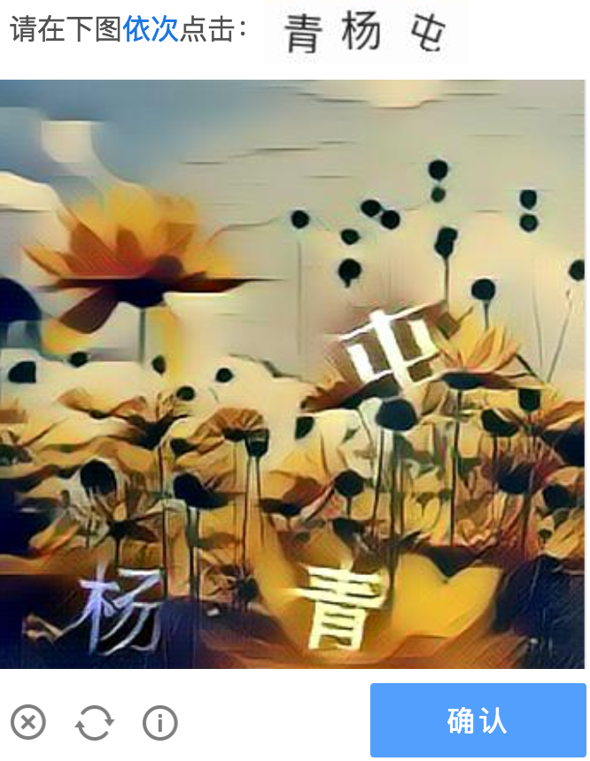
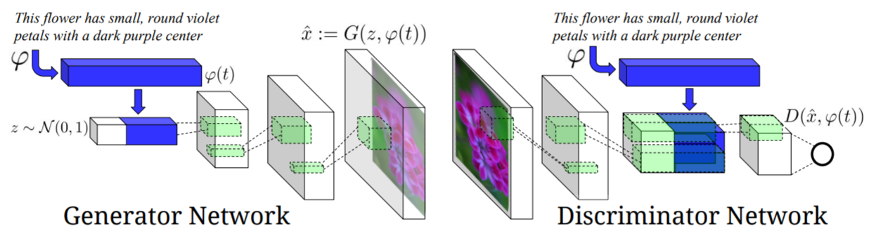

# secure
## What is it
project for Information Security class

## 选题背景
- 验证码作用是区分人与机器
- 合格的验证码应该基于AI-hard型问题设计
- 保护邮件等网络服务防止被bot滥用的重要手段

## 产品现况
### 12306

然而12306的图片验证码甚至用百度识图就可以识别。

### 比较合格的图形验证码:

### 移动验证码：
放一段视频或动图，验证码会不断移动

## 主流图形验证码

目前最主流的验证码：(机器学习检测+图像识别+逻辑验证)

## 研究现况
### 识别带噪音和干扰的验证码
去噪及抗干扰手段：图像二值化+开闭运算+腐蚀膨胀

处理字符粘结：骨架算法

验证码分割：连通域提取

识别：机器学习或深度学习都可以胜任
常见的用于图片识别领域的模型：SVM，CNN

## 主要思路
~~目前考虑到的几个方案见[这里](scheme.md).~~
在孙老师指导下的新的方案以及可行性分析在[这里](方案可行性.md).

前两天看到了一片文章有了新的想法，虽然暂时没时间了，但我肯定还会仔细研究研究的，这个估计才是最靠谱的方向。暂且把引用贴下来。
> Nguyen A, Yosinski J, Clune J. Deep Neural Networks are Easily Fooled: High Confidence redictions for Unrecognizable Images. In Computer Vision and Pattern Recognition (CVPR ’15), IEEE, 2015.

语义图形验证码 (deprecated)
=============

### 思路

选择带有语义的图片作为图形验证码的图片，让用户根据提示语选择语义匹配的图片。
例：
请选出下图中花瓣为白色、花蕊为黄色的花

### 参考文章

[Generative Adversarial Text to Image Synthesis](https://arxiv.org/abs/1605.05396)

### 模型 GAN-INT, GANINT-CLS

输入一段对花颜色、形状的描述，生成符合描述的图片

### 实现：

[text-to-image](https://github.com/paarthneekhara/text-to-image)

### 可行性分析：

选择该类型验证码的主要难点在于寻找大量合适的图片，使用GAN生成模型可以解决该问题，通过输入自然语言生成大量可靠的图片，作为图形验证码的素材。
