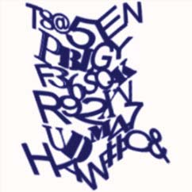

## 图形验证码与密码结合

ref： [Captcha as Graphical Passwords](doc/Captcha%20as%20Graphical%20Passwords.pdf)

ClickText:

## 用不合理的图片区分人与机器
随机显示一系列或被切割，或被颠倒，或被扭曲的图片，直到出现一个正常图片，用户确定以完成验证。或者一次性出现，由用户选择正常的那个。

考虑这个方案里用户只需要点一下，可以限制用户验证时的用时。

- 区别的实质在于机器不具备人类所谓的‘常识’，或者说机器训练出这样的常识在现有阶段难度较大。
- 缺点就是人类来说这样验证方式主观性太强，可能有些脑回路比较奇葩的用户会难以应对这样的验证码，甚至今天看来不合理的图片明天看就觉得合理了。
- 如何丰富验证码图像数据库是一个大麻烦。

## 拼图方案
固定两个图形块，然后选择另外两个图形块拼接出完整的图形。
为了防止机器识别，可以切割不规则，需要选择的图形用框包围。

大部分机器学习在图象识别中的任务就是从给定的图像中判别物体对象，这个方案并不要求识别出来是什么东西，它的要求实际上是“图像看起来符合人类的直觉即可”。
第一步训练需要训练出来四个模型对应四块缺少的情况，增加了难度。
