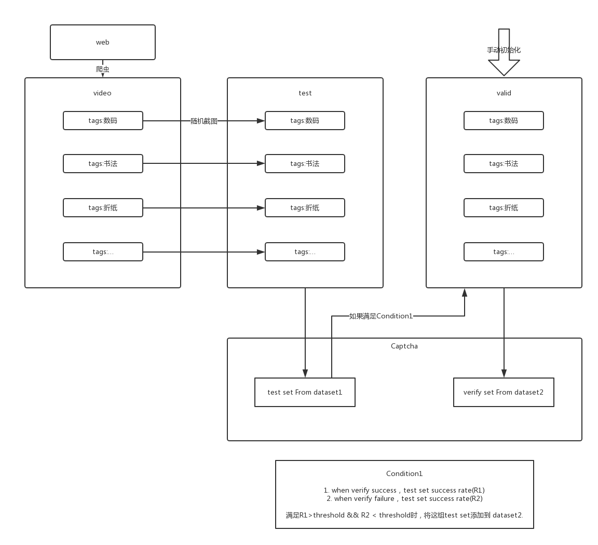

# 图形验证码方案

## Introduction

## Design
### Part1 从视频截取图片并根据tag分类
- 视频源：哔哩哔哩
- 截取方式：随机截取

九张图片分为三类(来自三个不同tag)
空间大小：3^9/(3×2×1)≈3,000

### Part2 根据用户验证情况反馈丰富数据集

## Jobs
- 从视频网站(bilibili)爬取视频和对应标签，依据标签建立文件夹，保存视频
- 从视频中随机截图，按标签建立文件夹并保存(dataset1)
- 简单的网页界面，每次随机选择三个tag，每个tag从对应dataset1中选3个，对应dataset2中选2个
- 测试以及调整参数
