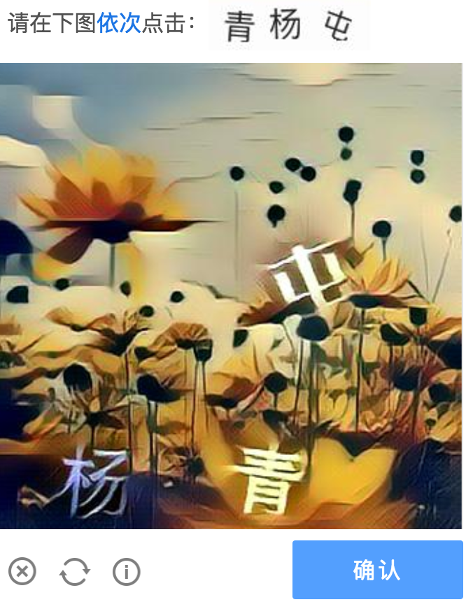

## 图形验证码与密码结合

ref： [Captcha as Graphical Passwords](doc/Captcha%20as%20Graphical%20Passwords.pdf)

ClickText:

## 图形验证码

目前最主流的验证码：(机器学习检测+图像识别+逻辑验证)

## 随机分割验证码
随机显示一系列或被切割，或被颠倒的图片，直到出现一个正常图片，用户确定以完成验证。
