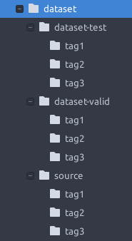

# 图形验证码方案

## Introduction

## Design
### Part1 从视频截取图片并根据tag分类
- 视频源：哔哩哔哩
- 截取方式：随机截取

九张图片分为三类(来自三个不同tag)
空间大小：3^9/(3×2×1)≈3,000

### Part2 根据用户验证情况反馈丰富数据集

## Jobs
- 从视频网站(bilibili)爬取视频和对应标签，依据标签建立文件夹，保存视频
- 从视频中随机截图按标签建立文件夹并保存(dataset1)
- 简单的网页界面，每次随机选择三个tag，每个tag从对应dataset1中选2个，对应dataset2中选3个
- 测试以及调整参数

### dataset文件夹目录结构

1. source目录保存爬取的视频，按照tag保存至对应文件夹
2. dataset-test目录，保存直接从视频中截取的图片，按照tag保存至对应文件夹
3. dataset-valid目录，保存经验证合格的图片，按照tag保存对应文件夹

### 爬虫模块
1. 根据tag查视频(比如https://www.bilibili.com/tag/5265682)
2. 根据视频找视频直链，www.bilibilijj.com 好像被限制了，如果这个不行了，有一个叫[you-get](https://github.com/soimort/you-get)的东西可以用下

### 截图模块
1. 对一个视频内的图片随机截图

### 网页界面
1. 随机选3个tag，从dataset-valid中的对应每个文件夹选三张图片，dataset-test中每个对应文件夹选两张图片。一共15张供用户分组。
2. 记录当用户验证通过时，来自test集的图片的分类正确率。(只要能记录这个数据就行，后端不是必需的)
3. 将满足条件的test集的图片移动至valid集。

### Others
#### 初始数据集
初始数据集，手动选择，使用ILSVRC上效果最好的模型筛选第一批图片。(有待调研)

#### 测试
- 直接使用截图，让用户做验证
- 使用Part2中提到的方案，筛选掉不合适的图片
- threshold选择多少才合适