# 方案可行性分析
## Introduction
图形验证码的两个难题，一是需要大量图片同时如何避免耗费大量人力给图片打标签，二是如何在一的前提下获得较好的用户体验。
后面分开两部分分析。
## How to Get Graphiacls
主要思路是从视频中截取，但根据设计的验证码任务需要对视频类别限制，目前暂时想到两类，以下分别介绍。
### Sort by time
思路：从每个视频随机选取一个时间点，然后每隔一秒取一张图，要求用户对它们排序。 
例子：  
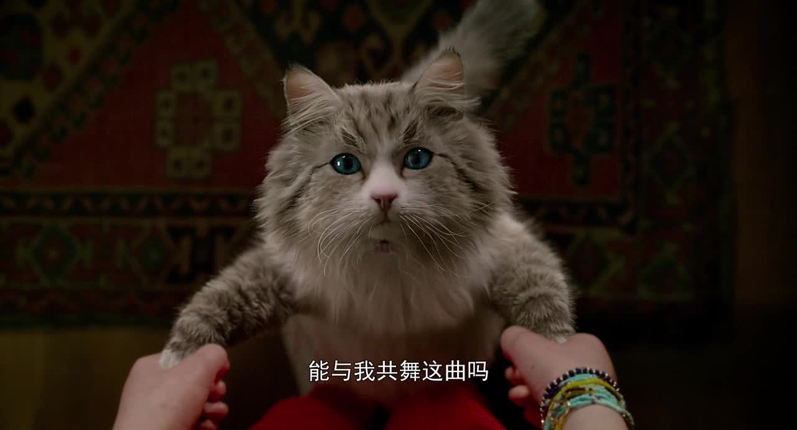
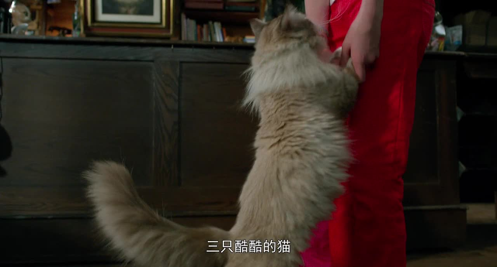
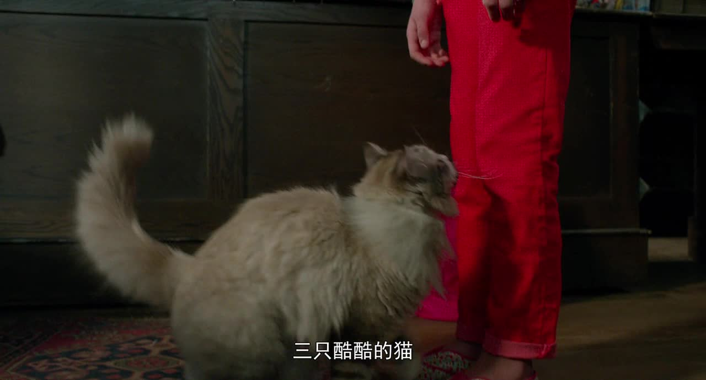
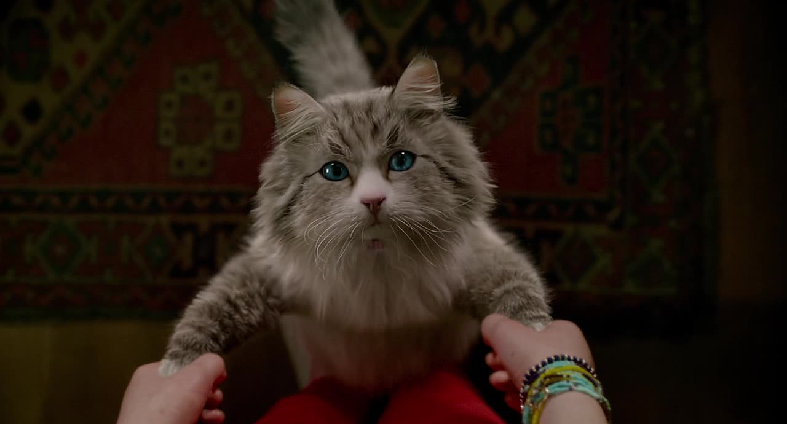
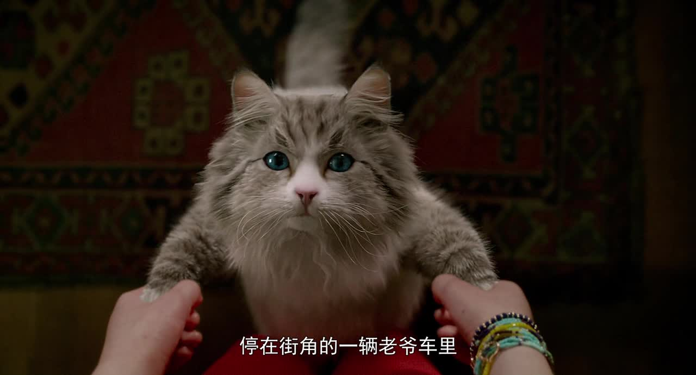
### Classify according to source video
思路：从每个视频随机截取5个图片，将多组图片混合，要求用户对来自同一视频的图片分入一组。 
例子： 
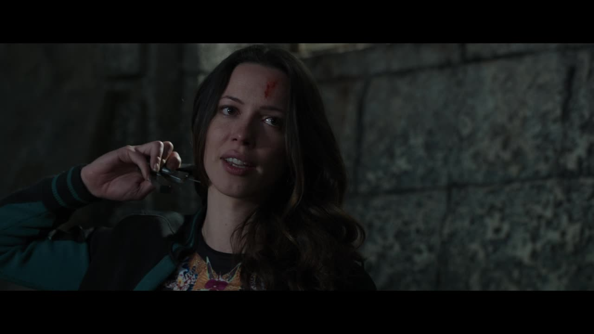

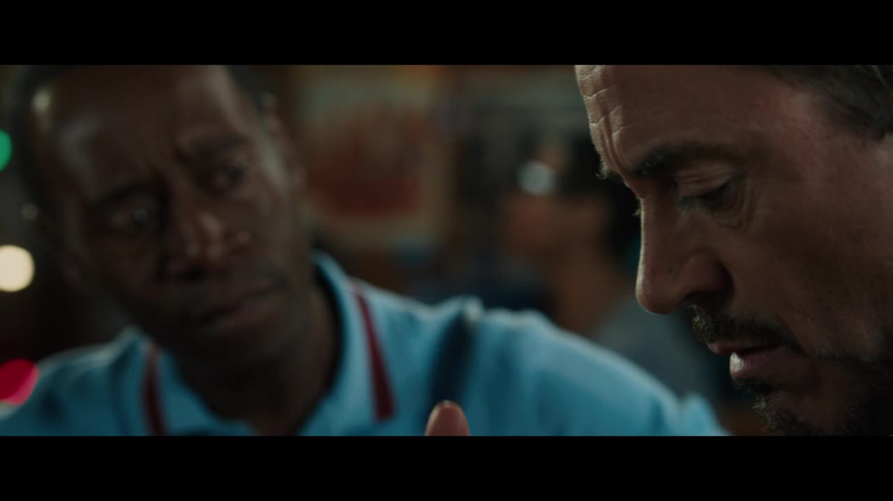
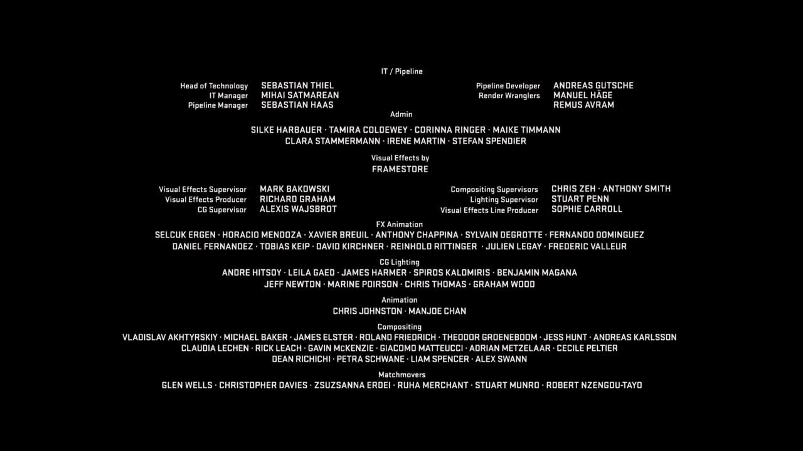
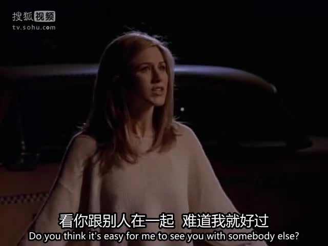
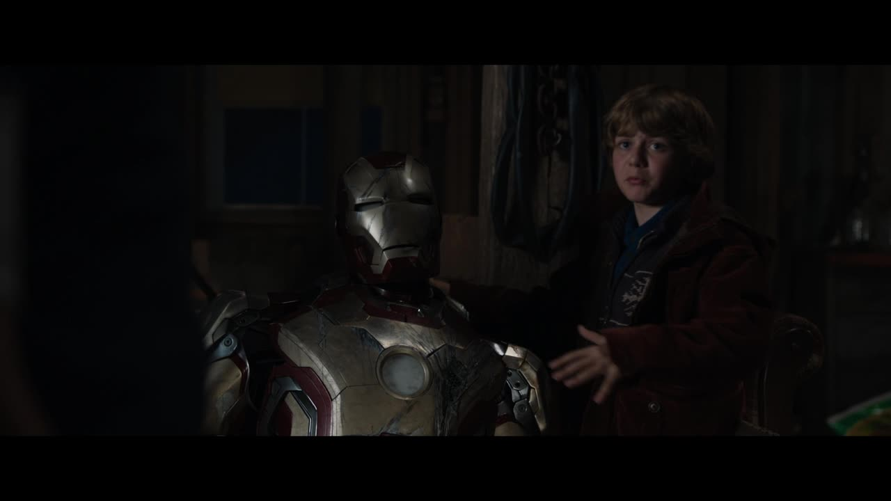
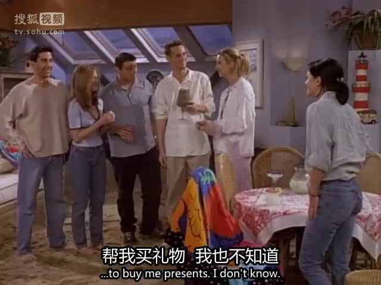

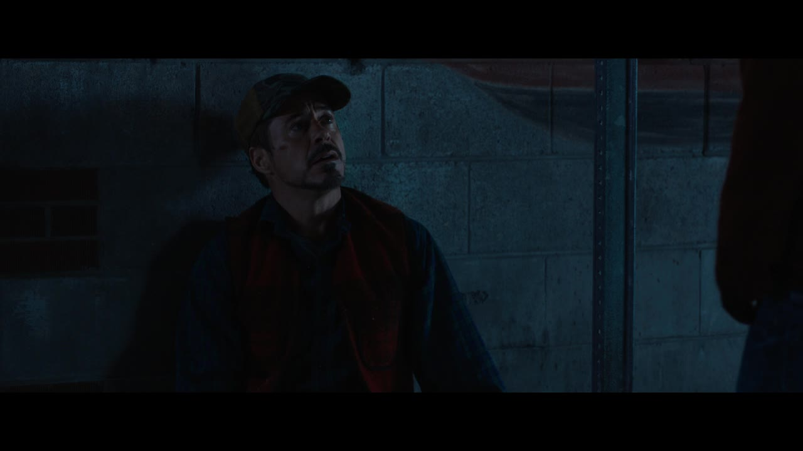

 具体哪个对用户而言体验更好，有待测试
### Source
+ 电影
+ 动画(不适合sort by time，连续静止帧或循环太多)
+ 体育节目(短时间时序特征，不适合classify according to source video)
+ 直播(暂时不可行)

## Determine whether or not user is human
决定验证码任务后，一个重要问题是，对目前的方案来看，随机截取图片虽然加大了机器的难度，但对用户来说也很有可能无法完成验证任务。这里讨论一下处理这个问题的可能可行方案。 
### 内隐式
主要思路：也许人类在完成一项任务时会有明显倾向，可以作为特征区分人与机器  
思路来源：《神经科学与密码学交汇:通过密码原语抵御软磨硬泡式攻击》 
具体描述：具体还没想好，思路也是来源于一个假设：人类作为人类社会的一员，会在同一时间段表现出相同的特征。这些特征也许是人类自己也难以认识到的，但是在完成一些主观性很强的任务时，会表现出来一样的趋势。(一个例子，温度也许会影响人类对不同色调图的选择)这个假设如何验证，以及如果是成立的，又如何设计验证码，暂时无法完成。
### re-*
主要思路：根据验证通过的用户的数据判断后续用户是否能验证通过  
思路来源：re-captcha  
具体描述：想法和re-captcha类似，只不过是把收集的数据反馈回验证过程。举例来说，验证任务是对两组图片排序，第一组如果排序正确，则验证通过，同时记录用户对第二组排序结果。通过记录大量用户结果，正确率超过阈值的则可以在以后成为第一组。 
之所以要这么做，是因为图片是随机采取的，这样尽量过滤掉一些不适合用来验证的样本，同时不影响用户正常验证。在理想情况下，通过验证的样本应该始终能让人类保持较高的通过率。

## TODO
什么样的视频适合取样。 
以及需要大量实验验证可行性。
